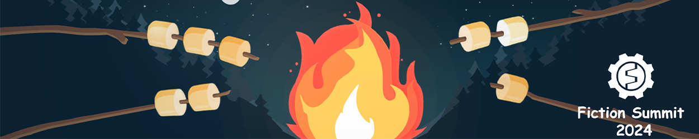

# shopping list 
## Items
1. Laptop
2. Big Mouse
3. SSD

# Getting Started

This section explains the Fiction Editor interface, menu items, and basic concepts like Scenes and Entities.

- **Installing Fiction Editor**  
  Downloading and installing Fiction Factory using Flaunch or client download.
  
- **Managing Projects**  
  How to manage existing projects and create new ones.
  
- **Fiction Editor Interface**  
  A detailed look at the main windows, shortcuts, and hotkeys.
  
- **Key Concepts**  
  Introduction to making Scenes, Entities, and Components.
  
- **Editor Features**  
  Customize workflows, integrate tools, and extend the Editor.
  
- **Quickstart Guides**  
  Learn to create games quickly.
  
- **Video Tutorials**  
  Comprehensive video guides from basic to advanced concepts.
[ LINK TO MORE INFO IN THIS README.MD](README.MD)